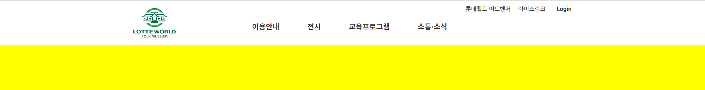
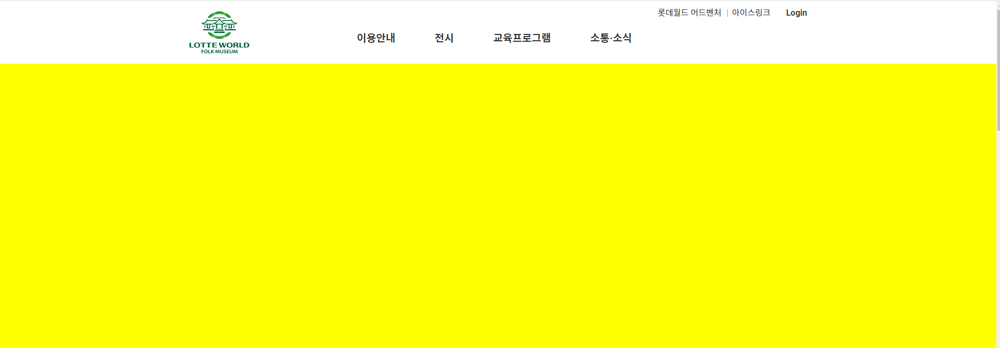

# 프로젝트명 - 이젠 회사 제작 ( FE(Front-End)  )

<!-- FE(Front-End) & BE(Back-End)  -->

## 팀원소개
FE/BE | 이름 | Github | 작업
:---|:---:|:---|:---
FE | 홍길동 | [@eun00](http://github.com/eun00) | [회사소개](http://), [회사소개](http://), [회사소개](http://), [회사소개](http://)
FE | 홍길동 | [@eun00](http://github.com/eun00) | [회사소개](http://), [회사소개](http://), [회사소개](http://), [회사소개](http://)
FE/BF | 유재석 | [@eun00](http://github.com/eun00) | [회사소개](http://), [회사소개](http://), [회사소개](http://), [회사소개](http://)
FE | 홍길동 | [@eun00](http://github.com/eun00) | [회사소개](http://), [회사소개](http://), [회사소개](http://), [회사소개](http://)

## 이젠회사사이트 URL
[바로가기](http://github.com)

## 이젠회사사이트 URL
FE : http://github.com
BE : http://github.com

## 이젠회사 기획서 
[pdf로 바로보기](http://github.com)

## 프로젝트 영상
<!--  -->

# 프로젝트 기능구현

## 프로젝트 메뉴 - 홍길동
- [x] 디자인, html/css / Vanilla JS 완료

>  
> 
> ### 기획서에 들어가는 기능 설명 내용 작성
> 
> 
> ### 메뉴 마우스 호버
> 

